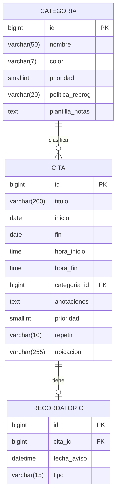

Diagrama entidad-relación de la app Calendario. Muestra las tres entidades principales — Categoria, Cita y Recordatorio — con sus atributos y las relaciones entre ellas: una categoría clasifica muchas citas, y una cita puede tener como máximo un recordatorio.
