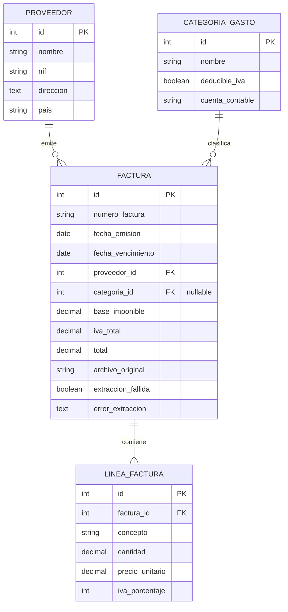

# Diagrama Entidad-Relación: Módulo Facturas

## Descripción de relaciones

- Proveedor -> Factura (1:N): Un proveedor emite múltiples facturas. FK proveedor_id en Factura. ON_DELETE PROTECT.
- CategoriaGasto -> Factura (1:N): Una categoría clasifica múltiples facturas. FK categoria_id nullable. ON_DELETE SET_NULL.
- Factura -> LineaFactura (1:N): Una factura contiene múltiples líneas. FK factura_id en LineaFactura. ON_DELETE CASCADE.
