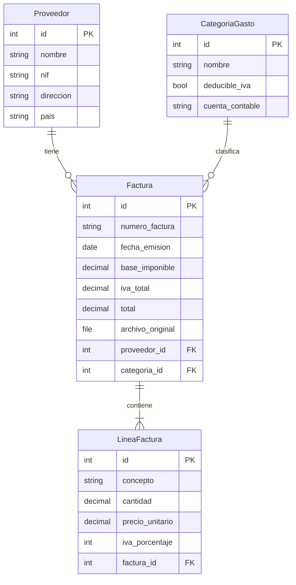

# Diagrama E/R — Facturas

```mermaid
erDiagram
    Proveedor {
        int id PK
        string nombre
        string nif
        string direccion
        string pais
    }

    CategoriaGasto {
        int id PK
        string nombre
        bool deducible_iva
        string cuenta_contable
    }

    Factura {
        int id PK
        string numero_factura
        date fecha_emision
        decimal base_imponible
        decimal iva_total
        decimal total
        file archivo_original
        int proveedor_id FK
        int categoria_id FK
    }

    LineaFactura {
        int id PK
        string concepto
        decimal cantidad
        decimal precio_unitario
        int iva_porcentaje
        int factura_id FK
    }

    Proveedor ||--o{ Factura : "tiene"
    CategoriaGasto ||--o{ Factura : "clasifica"
    Factura ||--|{ LineaFactura : "contiene"
```
